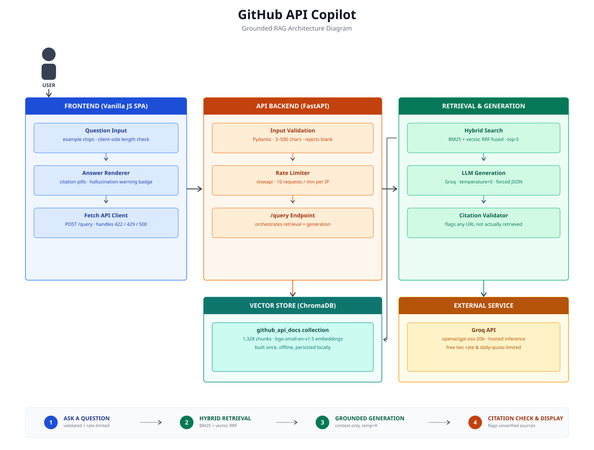

# GitHub API Copilot

A grounded question-answering tool for the GitHub REST API — ask about an endpoint, a parameter, or a status code, and get an answer cited straight back to GitHub's official spec.

**Goal:** answer developer questions about the GitHub API the way a senior teammate would — precisely, with a source, and with an honest "I don't know" when the docs don't cover it. Built with the same rigor as a production API — rate-limited, input-validated, and backed by a self-built evaluation pipeline that survived five different LLM-provider failures.

**[→ Live demo](https://github-api-copilot-1.onrender.com)**
*(first request may take 30–60s to wake up — free tier sleeps after 15 min idle)*

<br>

## Features

🔍 **Retrieval**

* Hybrid search — BM25 + vector similarity
* Reciprocal Rank Fusion to combine rankings
* Top-5 relevant chunks per query
* 94.29% recall@5 on a 105-question verified golden dataset

🧠 **Generation**

* Answers using only retrieved context — never model memory
* Forced structured JSON output (consistent format, every time)
* `temperature=0` for deterministic, reproducible answers

✅ **Citation Validation**

* Every returned source URL checked against what was actually retrieved
* Unverified citations flagged in the UI, not silently shown
* No answer without at least one real source

🔐 **API Hardening**

* Input validation (length, non-empty)
* Rate limiting (10 requests/min per IP)
* No raw stack traces ever returned to the client

<br>

## Answer vs. Refuse

**Answer**
Retrieval finds a relevant chunk of the OpenAPI spec → the model answers using only that chunk, with a citation.

**Refuse**
Nothing relevant is retrieved (usually because the question is conceptual — auth strategy, webhook policy — rather than about a specific endpoint) → the model says plainly that it isn't covered, instead of guessing.

<br>

## Tech Stack

**Backend**

* FastAPI
* slowapi (rate limiting)
* Pydantic (validation)

**Retrieval**

* ChromaDB (persistent vector store)
* sentence-transformers (`bge-small-en-v1.5`)
* BM25 (`rank_bm25`)

**Generation**

* Groq API (`openai/gpt-oss-20b`)
* Structured JSON output, `temperature=0`

**Frontend**

* Vanilla JS, no framework
* Citation pills + hallucination warning UI

<br>

## Architecture (high-level)



<br>

## Check the live demo here!

**[→ https://github-api-copilot-1.onrender.com](https://github-api-copilot-1.onrender.com)**

<br>

## Local Setup Instructions

### Prerequisites

* Python 3.12+
* A free [Groq API key](https://console.groq.com)

### Installation

```bash
git clone <your-repo-url>
cd rag-github-copilot
python3 -m venv venv && source venv/bin/activate
pip install -r requirements.txt
```

### Environment Variables

Create a `.env` file in the root directory:

```
GROQ_API_KEY=your_key_here
```

### Development

```bash
uvicorn app.main:app --reload
```

The app will be available at `http://localhost:8000`.

### Project Structure

```
app/
├── main.py              # FastAPI entrypoint, routes, middleware
└── static/
    └── index.html        # frontend
scripts/
├── ingestion/            # spec extraction, chunking, embedding
├── retrieval/            # hybrid search, RRF, generation
└── eval/                 # golden dataset, recall/refusal/faithfulness scripts
data/
├── processed/chroma_db/  # persisted vector store
└── eval/                 # golden dataset + eval results
```

<br>

## Evaluation

Tested against a 105-question golden dataset, every gold answer manually verified against GitHub's real docs — not LLM-self-graded.

| Metric | Result |
|---|---|
| **Recall@5** | **94.29%** (99/105) |
| **Refusal accuracy** | under correction — two golden-dataset questions found mislabeled during review |
| **Faithfulness** | **94.3%** — complete, all 105 questions judged |

<br>

## Deployment

Containerized with Docker, deployed on Render. Getting there surfaced a few real, worth-noting issues: a platform Python-version mismatch broke a pinned dependency, several packages installed locally were missing from `requirements.txt` (caught one at a time via clean-environment build failures), and the default Linux `torch` install pulled in several GB of unused NVIDIA CUDA libraries — fixed by installing the CPU-only build explicitly, which also cut build time from ~45 minutes to under 4.

<br>

## Known Limitations

* **Reranker built, not deployed** — causes a reproducible, intermittent crash isolated to this dev machine's hardware. Hybrid retrieval alone already hits 94.29% recall@5.
* **Scope is intentionally narrow** — built from GitHub's OpenAPI spec only, not its narrative guides, so conceptual questions are correctly out of scope.
* **Free-tier hosting** — the live demo sleeps after 15 minutes idle; first request after that takes 30–60s to wake up.

<br>

## License

MIT — see [LICENSE](./LICENSE)
